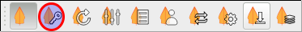
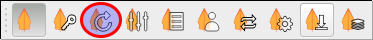
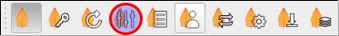
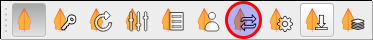
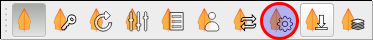
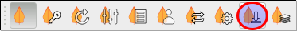
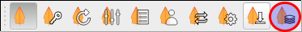

.. _toolbar:

Toolbar
=======

This Section contains the explanation of the different icons in the Toolbar
and the function behind the icons.

.. _tb_dock:

Toggle InaSAFE Dock
--------------------------

.. image:: images/inasafe/toolbar_toggle.png
   :scale: 75 %
   :align: center
   :alt: Toggle the Dock

   Toggle Dock

This button enables and hides the InaSAFE dock. After enabling the
dock you are able to move it around your screen. Dock and undock it wherever
you want to have it and keep it even as a separated window.

You can find more Information about the dock itself in the
:ref:`toolbar_dock` section.

.. _tb_keyword_editor:

InaSAFE Keyword Editor
-----------------------------

   Keyword Editor

The Keyword Editor button opens the Keyword editor which is described in
:ref:`keywords_system`. Basically it enables you to easily edit the
Keywords needed for InaSAFE to create useful output.

.. _tb_reset_dock_missst:

Reset Dock
----------

   Reset Dock

The Name is self speaking. In Case of any drawing issue inside the dock this
button just resets/reloads the dock to its initial state.

.. _tb_options:

InaSAFE Options
----------------------

   InaSAFE Options

This button opens the Options window which is described in
:ref:`toolbar_options`

.. _tb_impact_functions_browser:

InaSAFE Impact Functions Browser
---------------------------------------

.. image:: images/inasafe/toolbar_if_browser.png
   :scale: 75 %
   :align: center
   :alt: Impact Functions Browser

   InaSAFE Impact Functions Browser

This button opens the Impact Function Browser.

It basically enables you to filter and browse impact functions that are
available in InaSAFE. More information about that topic can be found
in :ref:`impact_functions`.

.. _tb_minimum_needs:

InaSAFE Minimum Needs Tool
----------------------------------

.. image:: images/inasafe/toolbar_needs.png
   :scale: 75 %
   :align: center
   :alt: Minimum needs tool

   InaSAFE Minimum Needs Tool

This tool will calculated minimum needs for evacuated people.

For a guidance how to use this tool take a look in :ref:`minimum_needs`.

.. _tb_converter:

InaSAFE Converter
------------------------

   InaSAFE Converter

This tool will convert an earthquake 'shakemap' that is in grid xml format
to a GeoTIFF file.
For more detailed information look at :ref:`converter`.

.. _tb_batch_runner:

InaSAFE Batch Runner
---------------------------

   InaSAFE Batch Runner

The Batch Runner lets you load saved scenarios (:ref:`save_scenario`) and
batch run them in one go.
You can find more information about using this tool at :ref:`batch_runner`

.. _tb_save_scenario:

Save current scenario
---------------------

   InaSAFE Save Current Scenario

This is the tool you need to prepare/save scenarios for the
:ref:`tb_batch_runner` Tool. It lets you save the current visible scenario
in QGIS to a :file:`.txt` file. This file you can open as a scenario again in
Batch runner and recalculate it.
A more detailed description is available in :ref:`batch_runner`

.. _tb_openstreetmap_downloader:

InaSAFE OpenStreetMap Downloader
---------------------------------------

   InaSAFE OpenStreetMap downloader

This tool will fetch building ('structure') data from the OpenStreetMap
project for you.
